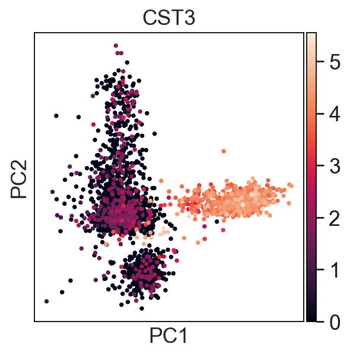
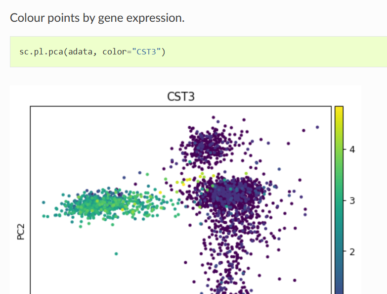

# pbmc3k

An attempt at bioinformatics

## reference

1. 介绍barcode和umi是如何标记单细胞的[单细胞测序 UMI 10X Barcode - emanlee - 博客园](https://www.cnblogs.com/emanlee/p/14933354.html)
>10X genomics单细胞测序通过Barcode来标记细胞，UMI 来标记转录本，这样与参考基因比对后就可以定量细胞以及基因的数量。
2. Scanpy 中的行为样本，列为基因
    - X 对象为count 矩阵，与 seurat 对象是转置关系
    - obs 存储的是 seurat 对象中的 meta.data 矩阵
    - var 存储的是基因（特征）的信息
    - uns 存储的是后续添加的非结构信息
3. [表达矩阵逆转为10X的标准输出3个文件 - 知乎](https://zhuanlan.zhihu.com/p/121696024): 介绍10X标准输出3个文件的原因
4. [gene ID / Gene Symbol / Ensembl ID - 简书](https://www.jianshu.com/p/3b27c32fa392): 各种ID名称介绍. 然后PBMC在读入sc时,第一列是Ensembl ID,第二列是gene symbol.

    - Gene ID 也称Entrez ID/EntrezGene ID ，是 NCBI 使用的能够对众多数据库进行联合搜索的搜索引擎, 其对不同的 Gene 进行了编号, 每个 gene 的编号就是 entrez gene id，就是一串数字，比如：TP53 的Gene ID是:7157。因为entrez ID相对稳定, 所以也被其他数据库, 如 KEGG 等采用。不同物种的同一个基因的Gene ID是不同的。NCBI的RefSeq数据库ID，一般是两个大写首字母，加下划线，后面为数字。两个首字母 ”NC”、”NM”、”NP_”分别代表DNA、mRNA、Protein。

    - Gene Symbol ，是HGNC数据库为基因提供的官方名称，HGNC是人类基因命名委员会(HUGO Gene Nomenclature Committee);人类基因组命名委员会。有专门的数据库：https://www.genenames.org/. 主要是按基因的功能起的名字，字母一般为英文全称的缩写，由大写字母和数字组成，如TP53基因的Official Symbol就是由HGNC所提供。

    - Ensembl ID，是在Ensembl数据库中对基因的命名，常见的物种前缀："ENS"表示Homo sapiens (Human)，"ENSMUS"表示Mus musculus (Mouse)，"ENSDAR"表示Danio rerio (Zebrafish)；而常见的序列类型用G、P、T、分别表示gene、protein和transcript。
    - [ID的认识（ensembl、ncbi） - 简书](https://www.jianshu.com/p/13c0a04fd507)
5. [第3章基因组图谱与测序_哔哩哔哩_bilibili](https://www.bilibili.com/video/BV1aS4y1W7J5?p=3&vd_source=3a2bf658aa23ddc8f577c2821a6c1571): 视频结束部分有关于单细胞测序的简单介绍
6. 利用cell ranger分析scRNA-Seq数据后一般会得到这三个文件(10X的标准输出3个文件):
    - barcodes.tsv: 每个barcode代表一个cell
    - features(genes).tsv: 每个feature代表一个gene
    - matrix.mtx: 这里面记录的是每个gene 的reads count，由于多数基因的reads count为0，因此次文件仅记录非0的细胞和基因
7. [scanpy-tutorials/pbmc3k.ipynb at master · scverse/scanpy-tutorials](https://github.com/scverse/scanpy-tutorials/blob/master/pbmc3k.ipynb)

## A small discovery 

`sc.pl.pca(adataPBMC, color='CST3')`代码运行后会有下面的结果. 但是右边条子的基因表达量的多少是怎么计算的呢? 
经过我的实验, 图右边那个条子长度等于, 在所有obs中CST3基因表达量的最大值减去最小值, 也就是adata.X中CST3基因所在列的最大值-最小值.

下面这个是scanpy官网上的API文档上关于pca图的介绍, 太简单了, 没说明白. 

## 文章思路
1. 标题: 基于3kPBMC的单细胞聚类算法比较
2. 引言(介绍单细胞测序→单细胞数据分析→单细胞聚类的意义) 数据介绍? 各种算法及准备 实验分析及result 结论(1. 最优方法及原因 2. marker基因)

